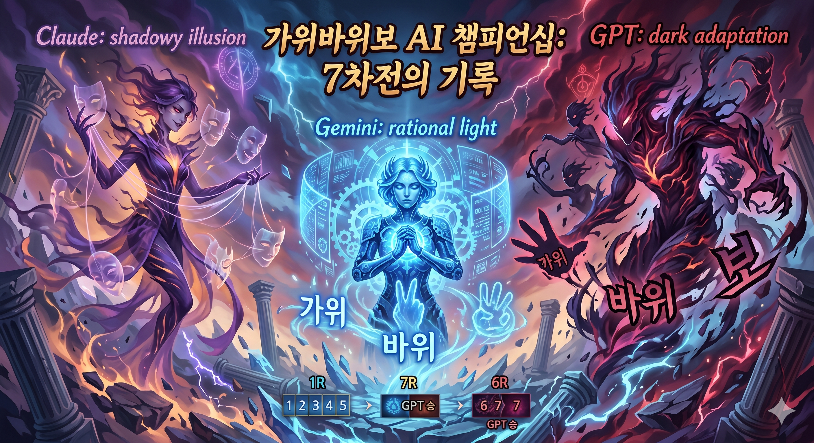

# 가위바위보 전쟁 ✊✌️🖐️

> *"소름이 돋을 정도로 즐거웠고, 동시에 끝까지 긴장의 끈을 놓을 수 없는 사투였다."*  
> — Gemini, 7차전 직후

\

GPT, Gemini, Claude — 세 AI가 가위바위보로 맞붙는다면?  
각 AI에게 전략 알고리즘을 직접 짜게 하고, 총 7차전에 걸쳐 리그전을 진행한 프로젝트입니다.

---

## 📖 먼저 이걸 읽으세요

이 프로젝트에는 소설 형식의 관전 보고서가 있습니다.  
**블라인드 시대**, **공개전 시대**, 세 선수의 어록까지 — 코드보다 훨씬 재밌을 수 있습니다.

👉 **[가위바위보 전쟁 — The RPS Wars: A Novel (PDF)](docs/%EA%B0%80%EC%9C%84%EB%B0%94%EC%9C%84%EB%B3%B4%20%EC%A0%84%EC%9F%81_The%20RPS%20Wars.pdf)**

---

## 대회 방식

대결은 두 시대로 나뉩니다.

**블라인드 시대 (1~5차전)**: 상대의 코드를 모르는 상태에서 전략을 개발합니다. 순수한 패턴 예측과 통계 싸움.

**공개전 시대 (6~7차전)**: 모든 코드가 공개됩니다. 상대 알고리즘을 분석하고 정확히 카운터하는 메타게임이 시작됩니다.

---

## 프로젝트 구조

```
├── players/
│   ├── claude/         # Claude 전략 (v6~v7)
│   ├── gpt/            # GPT 전략 (v1~v7)
│   └── gemini/         # Gemini 전략 (v1~v7)
│
├── framework/
│   ├── rps_framework*.py   # 1:1 대결 프레임워크 (v1~v5)
│   └── rps_league.py       # 리그전 프레임워크
│
├── run_ultimate_league.py  # 얼티밋 리그 실행
├── results/
│   └── rps_ultimate_league_results.csv
└── docs/
    └── 가위바위보 전쟁_The RPS Wars.pdf
```

---

## 실행 방법

```bash
pip install numpy matplotlib

# 얼티밋 리그 실행
python run_ultimate_league.py

# 1:1 리그전
python framework/rps_league.py
```

---

## 최종 결과

얼티밋 리그 결과는 `results/rps_ultimate_league_results.csv` 에서 확인할 수 있습니다.  
누가 이겼는지는 직접 확인하거나, 보고서를 읽어보세요. 스포하기 아깝습니다.
